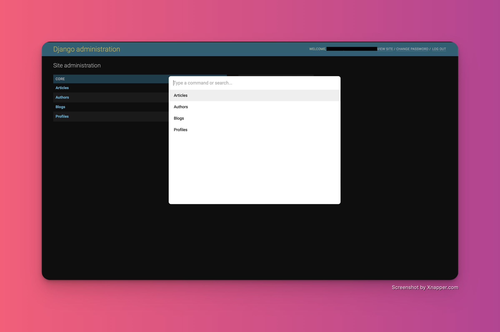

# Django Command Palette

Palette is a Django app to add command palette to your Django admin.. This will make it
easy to navigate the Admin page with Ctrl/Cmd + k



## Quick start

1. Install palette from PyPI

   ```
   pip install django-command-palette
   ```

2. Add `"palette"` to your `INSTALLED_APPS` setting like this::

   ```
   INSTALLED_APPS = [
      ...
      'palette.apps.PaletteConfig',
      'palette.apps.PaletteAdminConfig',

      # django.contrib.admin # Remove this line from code
   ]
   ```

3. Start the development server and visit http://127.0.0.1:8000/admin/

4. Visit http://127.0.0.1:8000/admin and type `Ctrl/Cmd + K`

## Credits

This project is heavily inspired by [kbar](https://github.com/timc1/kbar)
